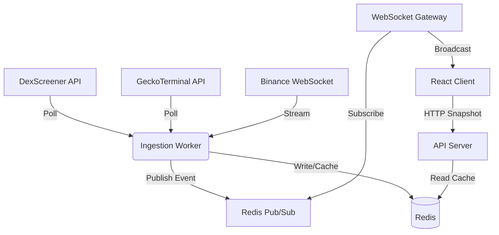

# AxiomLite | Real-Time Meme Coin Aggregator

A high-performance, full-stack crypto data aggregator that merges real-time data from multiple decentralized exchanges (DEXs) into a single, unified feed. Built with a focus on **Scalability**, **Resilience**, and **Zero-Latency UX**.


---

## 🏗 Architecture Design

The system follows a **Hybrid Event-Driven Architecture** combined with a **CQRS (Command Query Responsibility Segregation)** pattern to handle high-throughput data without bottlenecks.

### High-Level Data Flow


### Core Components

1.  **Ingestion Worker (The "Write" Side)**
    *   **Role:** Background process independent of user traffic.
    *   **Logic:** Fetches data from DexScreener/GeckoTerminal every 30s. Connects to an upstream Binance WebSocket to correlate SOL price movements with meme coin prices in real-time.
    *   **Tech:** `BullMQ` for job management, `Node-Cron` for scheduling.

2.  **API Server (The "Read" Side)**
    *   **Role:** Serves HTTP requests for the initial data snapshot.
    *   **Design:** Follows **CQRS**. It never calls external APIs directly. It only reads pre-aggregated data from Redis. This ensures <50ms response times even under heavy load.
    *   **Tech:** `Fastify` (Low overhead), `Redis`.

3.  **WebSocket Gateway (The Event Bus)**
    *   **Role:** Broadcasts live price updates to connected clients.
    *   **Design:** Stateless. Subscribes to Redis channels (`market_data_feed`) and pushes payloads to clients. Decoupled from the ingestion logic.

4.  **Fat Client (The Frontend)**
    *   **Role:** Manages view logic and state.
    *   **Design:** Fetches a large "Master Snapshot" (500+ tokens) on load. Handles Filtering, Sorting, and Searching **in-memory** on the client side. This results in **zero-latency interaction** for the user (no spinners when sorting).

---

## 🧠 Key Design Decisions

### 1. Why "Fat Client" instead of Server-Side Filtering?
*   **Decision:** We fetch 500 tokens once and filter locally.
*   **Reasoning:** In a trading dashboard, users expect instant feedback. Waiting for a server round-trip just to sort by "Top Gainers" feels sluggish. Modern devices can easily handle sorting 500 objects in memory.
*   **Trade-off:** Initial load is slightly heavier (KB size), but interaction latency drops to 0ms.

### 2. Smart Merging Strategy
*   **Problem:** The same token (e.g., "Bonk") exists on Raydium, Orca, and Meteora with different prices.
*   **Solution:** The Ingestion Worker aggregates them into a single "Asset" entity.
    *   **Price:** Average of all sources.
    *   **Volume/Liquidity:** Maximum value found (to represent total market depth).
    *   **Metadata:** Merges protocol tags.

### 3. Resilience via Exponential Backoff
*   **Problem:** DexScreener rate-limits aggressively (300 req/min).
*   **Solution:** Implemented a custom `HttpClient` with **Exponential Backoff and Jitter**.
    *   If a request fails (429), we wait `1s`, then `2s`, then `4s` + random noise.
    *   This prevents "Thundering Herd" retries that would cause a permanent ban.

### 4. Browser Fallback Mode
*   **Problem:** What if the Backend Server goes down?
*   **Solution:** The React client has a built-in **Fallback Service**. If `localhost:3000` is unreachable, it automatically switches to fetching data directly from DexScreener in the browser and simulates WebSocket updates locally. The user never sees a blank screen.

---

## 🚀 Setup & Installation

### Prerequisites
*   Node.js v18+
*   Redis (Required for Backend/Worker)

### 1. Installation
```bash
# Install dependencies for both frontend and backend
npm install
```

### 2. Running Locally (Development)
You need **3 separate terminals** to run the full stack:

**Terminal 1: Backend API**
```bash
npm run server
# Runs on http://localhost:3000
```

**Terminal 2: Ingestion Worker**
```bash
npm run worker
# Connects to Redis and starts fetching
```

**Terminal 3: Frontend**
```bash
npm start
# Runs on http://localhost:3001
```

---

## 🧪 Testing
The project includes Unit and Integration tests using **Jest**.

```bash
# Run backend tests
npx jest
```

**Coverage:**
*   Happy Path (Caching, Sorting, Pagination).
*   Edge Cases (Empty Cache, Invalid Cursors).
*   Integration (Mocked External API responses).

---

## 📚 API Documentation

### `GET /api/tokens`
Retrieve the aggregated list of tokens.

**Query Parameters:**
*   `limit` (number): Max items to return (Default: 50).
*   `cursor` (string): Base64 cursor for pagination.
*   `sortBy` (enum): `VOLUME`, `PRICE_CHANGE`, `MARKET_CAP`, `LIQUIDITY`.
*   `search` (string): Search by name, ticker, or address.
*   `timeFrame` (enum): `1H`, `24H`, `7D`.

**Response:**
```json
{
  "success": true,
  "data": [
    {
      "token_ticker": "BONK",
      "price_usd": 0.000025,
      "volume_24h": 50000000,
      "source": "Aggregated"
    }
  ],
  "pagination": {
    "nextCursor": "MTA=",
    "total": 500
  }
}
```

---

## 🛠 Tech Stack

*   **Runtime:** Node.js, TypeScript
*   **Frontend:** React 18, Tailwind CSS, Recharts
*   **Backend:** Fastify, WebSocket (`ws`)
*   **Data:** Redis (Pub/Sub & Caching)
*   **Async:** BullMQ, Node-Cron
